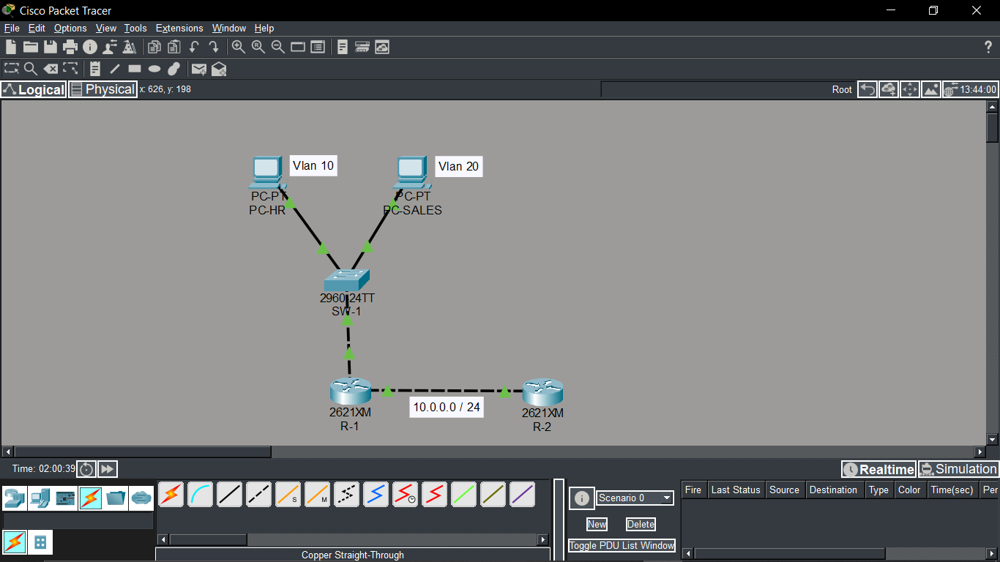
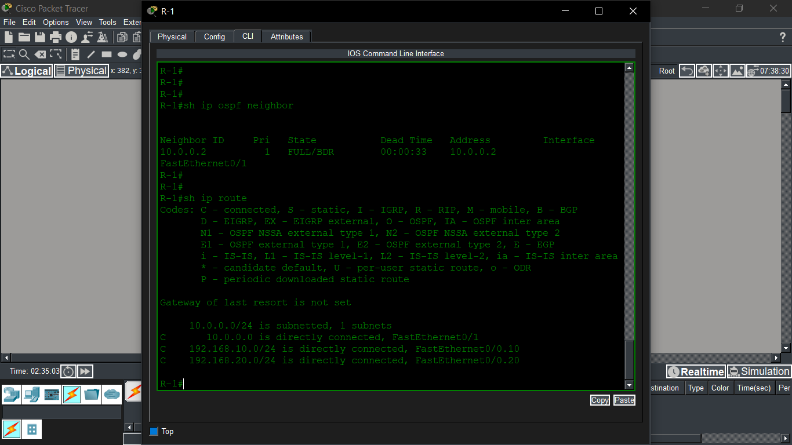
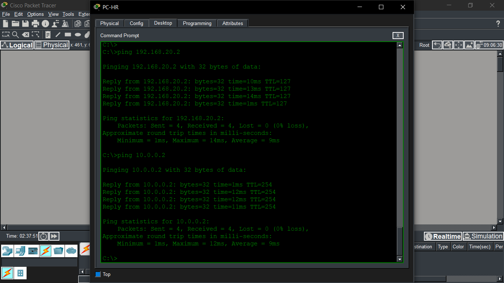
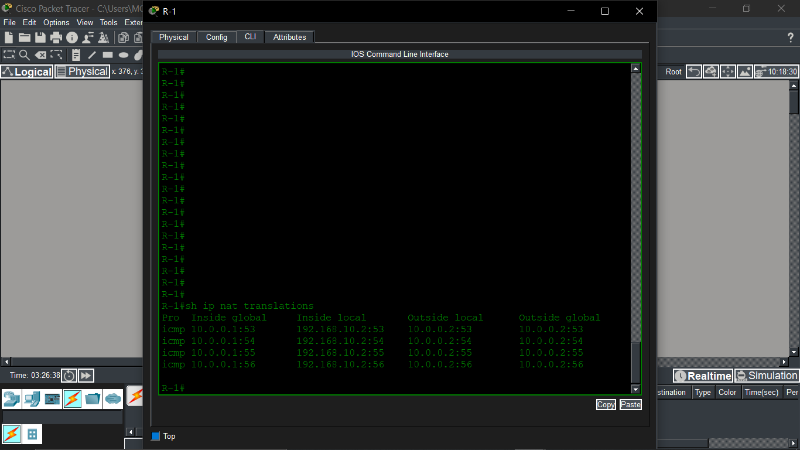

# CCNA Lab: VLAN + OSPF + NAT

## 📌 Overview
This lab demonstrates core networking concepts including VLAN segmentation, Inter-VLAN routing, OSPF dynamic routing, and NAT configuration using Cisco Packet Tracer.

---

## 🛠 Technologies Used
- Cisco Packet Tracer
- VLAN
- Inter-VLAN Routing (Router-on-a-Stick)
- OSPF (Open Shortest Path First)
- NAT (Network Address Translation)
- ACL (Basic)

---

## 🧪 Topology

---

## ⚙️ Configuration Highlights
- Configured VLAN 10 and VLAN 20 on switch
- Implemented Router-on-a-Stick for inter-VLAN routing
- Established OSPF neighbor adjacency between routers
- Configured NAT overload on edge router
- Verified connectivity using ping and routing tables

---

## ✅ Verification
- OSPF neighbor state: FULL
- Successful end-to-end connectivity
- NAT translations verified

---

## 📸 Screenshots

### OSPF Neighbor

### Routing Table

### Ping Test

### NAT Translation

---

## 🎯 Outcome
This lab helped me understand real-world network configuration and troubleshooting using Cisco IOS.

---

## 📥 Download Lab File
[Download Packet Tracer File](vlan-ospf-nat-lab.pkt)

## 👨‍💻 Author
Mohana Chidambaram
